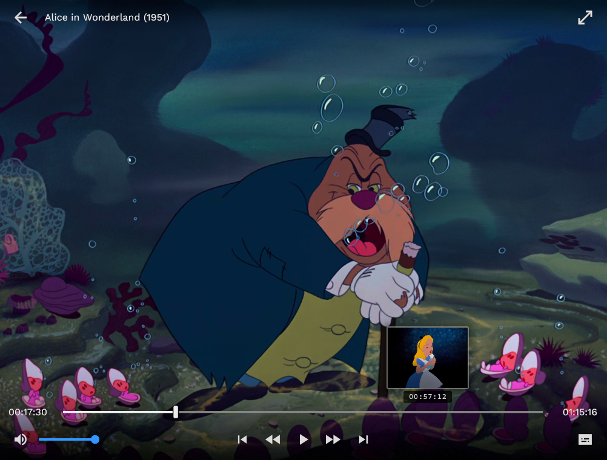

# Jangal

Desktop-centric native media explorer and player.

  
  

## Goals

- Non-intrusive media management - In other words, Jangal does not touch the media files
  and does not expect any particular file structure. It will scan any list of directories
  for discovery.
- Automatically finds and populates metadata from TMDB.
- Native, fast, and low profile.
- Built-in video player that tracks watched movies/episodes.

## Non-goals

- Be an all-in-one media manager/server. This is not a Plex/Jellyfin/etc alternative.
- Support non-desktop platforms (e.g., smart TV). In fact, Kodi lacking a good desktop UX
  was the motivating factor for Jangal.
